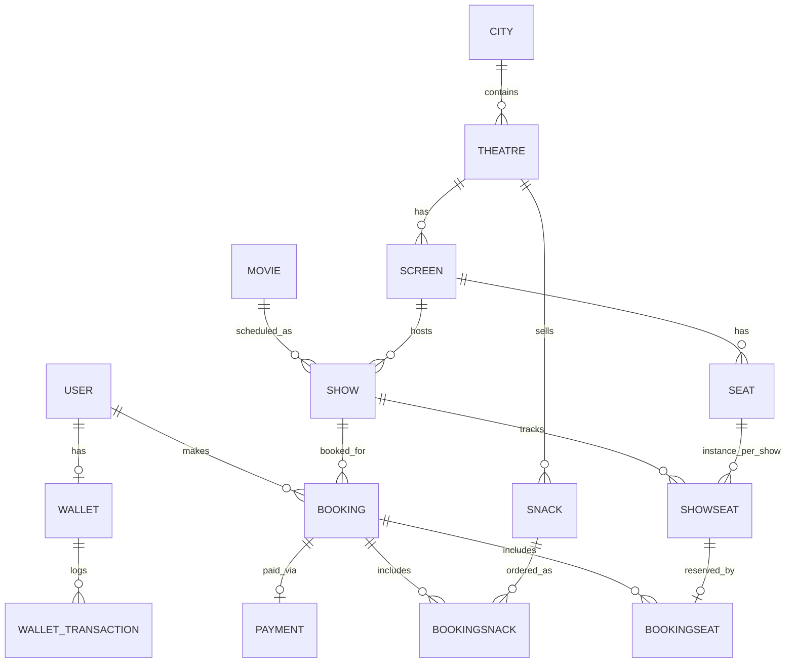
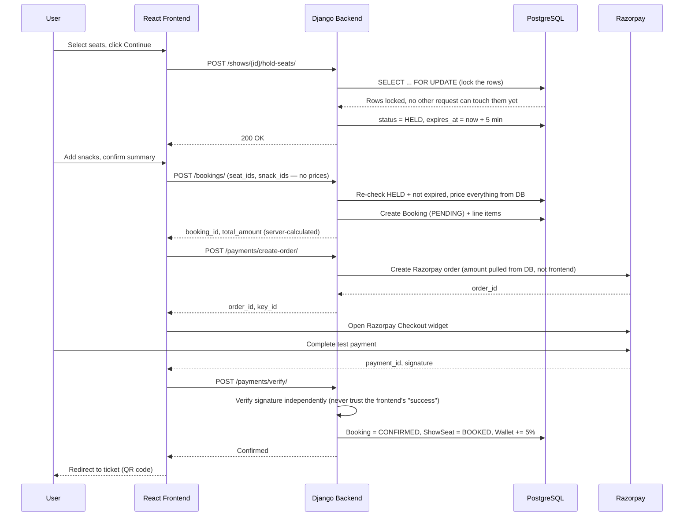

<div align="center">


<br/>


**A production-shaped movie ticket booking platform — real TMDB movie data, concurrency-safe seat locking, verified Razorpay payments, a loyalty wallet, snack add-ons, QR e-tickets, and a full custom admin panel. Built solo, deployed for free, and actually works end to end.**

| 🌐 Live App | ⚙️ Backend API | 💻 Source |
|:---:|:---:|:---:|
| [movie-ticket-booking-three-plum.vercel.app](https://movie-ticket-booking-three-plum.vercel.app) | [cinemax-backend-raok.onrender.com](https://cinemax-backend-raok.onrender.com) | [github.com/Arnav-Naive/movie-ticket-booking](https://github.com/Arnav-Naive/movie-ticket-booking) |

</div>

> 📸 **SCREENSHOT — `hero-homepage.png`**: Capture the Home page with the hero carousel mid-rotation on a real movie, the filter pills visible, and at least 6 movie cards in the grid below. Desktop browser width (~1440–1920px). Place at the top of the Demo Gallery section below.

---

## 📑 Table of Contents

- [The Problem & The Idea](#-the-problem--the-idea)
- [Demo / Screenshots](#-demo--screenshots)
- [Features](#-features)
- [Architecture](#-architecture)
- [Tech Stack](#-tech-stack)
- [How It Works (Deep Dive)](#-how-it-works-deep-dive)
- [Project Structure](#-project-structure)
- [Quick Start](#-quick-start)
- [Running the System](#-running-the-system)
- [API Reference](#-api-reference)
- [Key Design Decisions](#-key-design-decisions)
- [Known Limitations](#-known-limitations)
- [Project Numbers](#-project-numbers)
- [Development Log](#-development-log)
- [Hardest Bugs Fixed](#-hardest-bugs-fixed)
- [FAQ](#-faq)
- [Future Improvements](#-future-improvements)
- [Git Workflow](#-git-workflow)
- [Footer](#footer)

---

## 🧩 The Problem & The Idea

Booking a movie ticket online looks simple from the outside — pick a movie, pick a seat, pay, get a ticket. Underneath, it's a concurrency and trust problem: many people can hit "book" on the same seat within milliseconds of each other, and the browser can never be trusted to report the correct price, because anyone can open DevTools and edit a number before it's sent.

**The naive way this usually gets built (and breaks):**

```
User clicks seat A5
   → Frontend marks A5 as "selected" in local state
   → Frontend sends { seat: "A5", amount: 250 } to the backend
   → Backend trusts the amount, charges ₹250, marks A5 booked

Problem: two users can both "select" A5 in the same instant — nothing
stopped a second booking from also succeeding. And the "amount" field
came from the browser, which anyone can edit before sending.
```

**How CineMax actually does it:**

```
User selects seat A5
   → Backend locks A5's database row (SELECT ... FOR UPDATE) inside
     an atomic transaction — a second request for the same seat has
     to wait until the first one finishes, and by then A5 is no
     longer available
   → Seat flips to HELD for 5 minutes (not booked yet — just reserved)
   → Booking is created, and the price is calculated from the
     database (show price × seat count + snacks + fee) — the
     frontend never gets a say in the final amount
   → Razorpay order is created for that database-calculated amount
   → After payment, the backend independently verifies Razorpay's
     cryptographic signature before ever marking anything BOOKED
```

Every irreversible action (locking a seat, confirming a booking, crediting wallet points) happens on the server, inside a transaction, based on what's actually in the database — never based on what the browser claims.

---

## 🎥 Demo / Screenshots

<div align="center">

| # | Screenshot | What to Capture | Filename |
|---|---|---|---|
| 1 | Home page | Hero carousel active, filter pills, movie grid (6+ cards) | `hero-homepage.png` |
| 2 | Movie Details | A movie with cast chips and an embedded YouTube trailer visible | `movie-details-trailer.png` |
| 3 | Seat Selection | Mid-selection: a few red (selected) seats, hold countdown timer visible | `seat-map-selection.png` |
| 4 | Group Seat Finder | After clicking "Find Seats" — highlighted recommended block + message | `group-seat-finder.png` |
| 5 | Snacks & Combos | A couple of items added with quantity steppers, running total visible | `snacks-page.png` |
| 6 | Booking Summary | Tickets + snacks + convenience fee + grand total all itemized | `booking-summary.png` |
| 7 | Razorpay Checkout | The Razorpay modal open mid-payment | `razorpay-checkout.png` |
| 8 | Digital Ticket | QR code visible, snacks section shown if applicable | `digital-ticket-qr.png` |
| 9 | My Bookings | One CONFIRMED and one CANCELLED booking, 🍿 snacks tag visible | `my-bookings.png` |
| 10 | Profile / Wallet | CineRP balance + recent transaction history | `wallet-profile.png` |
| 11 | Admin Dashboard | Stats cards + top movies list | `admin-dashboard.png` |
| 12 | Admin Seat Builder | The bulk seat-layout builder form with a screen selected | `admin-seat-layout-builder.png` |
| 13 | Ticket Scanner | The camera-based scan page with the video feed active | `scan-ticket-camera.png` |
| 14 | Error State | Attempting to hold an already-held seat, or "No movies match your filters" | `error-state-seats.png` |
| 15 | Mobile View | Home page at a phone viewport width, hamburger menu open | `mobile-responsive-home.png` |

</div>

---

## ✨ Features

| Feature | Details |
|---|---|
| **Authentication** | JWT-based register/login (Simple JWT), 2-hour access tokens, custom User model set up before the first migration to avoid a painful mid-project switch |
| **Real Movie Data** | Live TMDB integration — posters, ratings, genres, cast, trailer — with a real-time search that also surfaces movies not yet in the local catalog |
| **Admin-Gated Auto-Import** | Regular users can search and browse; only admins can pull a new movie from TMDB into the live catalog, preventing catalog spam |
| **City / Theatre / Screen / Seat** | Full admin CRUD, plus a bulk seat-layout builder (`A:8:REGULAR, B:8:PREMIUM`) instead of adding seats one by one |
| **Show Scheduling** | Filterable by movie, city, theatre, and date |
| **Concurrency-Safe Seat Holding** | Row-level database locks (`SELECT ... FOR UPDATE`) inside atomic transactions — verified with real parallel requests, not just theory |
| **Group Seat Finder** | "I need 4 seats together" — scans each row for a contiguous available block, falls back to the closest cluster if no perfect block exists |
| **Snacks & Combos** | Optional food add-ons attached to the same booking and the same payment — no separate cart or payment flow |
| **Razorpay Payments** | Test Mode order creation + independent signature verification server-side; a booking is never confirmed on the frontend's word alone |
| **CineRP Loyalty Wallet** | 5% of every paid booking is credited as wallet points, redeemable on future bookings; cancellations correctly reverse earned points and refund spent points |
| **QR E-Tickets** | QR encodes a separate random verification token — never the raw booking ID — so a ticket can't be forged by guessing |
| **Camera Ticket Scanning** | Live camera QR scanning for admins and designated "verifier" users (a role admins can grant to any account without giving full admin access) |
| **Custom Admin Panel** | Dashboard, movies, theatres/screens/seat-builder, shows, all-bookings, users, snacks, and ticket verification — a real second frontend surface, not just Django's default admin |
| **Automated Tests** | 18 backend tests covering auth, permissions, seat-hold concurrency, bookings, and payment edge cases |
| **Fully Dockerized** | One `docker compose up` boots Postgres, backend, and frontend together |
| **Deployed Live** | Render (Django + Postgres) + Vercel (React) — both on free tiers |

---

## 🏗️ Architecture

### Request Lifecycle & Data Model



A physical seat (`SEAT`) exists once per screen, permanently. But its availability changes per show — seat A1 might be booked for the 5 PM showing and free for the 8 PM one. `SHOWSEAT` is the table that makes this work: one row per (show, seat) pair, carrying the actual `AVAILABLE` / `HELD` / `BOOKED` status. `unit_price` is duplicated onto `BOOKINGSNACK` (not just referenced from `SNACK`) so that if an admin changes a snack's price next month, every *past* order still shows the price it was actually bought at.

### Seat Hold → Payment → Confirmation (the critical path)



The signature verification step is the whole reason this is safe — without it, anyone could open the browser console, fake a "payment succeeded" message to the frontend, and get a free booking. Razorpay's signature can only be produced by Razorpay's own servers using a secret key the frontend never sees.

---

## 🛠️ Tech Stack

| Layer | Tech | Why This Over the Obvious Alternative |
|---|---|---|
| Backend framework | Django + Django REST Framework | Built-in admin panel, ORM, and migrations meant a working, permissioned backend existed from day one — no time spent hand-rolling auth scaffolding that Flask/FastAPI would've required |
| Auth | Simple JWT | Stateless tokens work cleanly across two separate origins (Vercel frontend, Render backend) — session-cookie auth gets messy across different domains |
| Database | PostgreSQL | Needed real row-level locking (`SELECT FOR UPDATE`) for seat concurrency — SQLite can't do real concurrent writes, and Postgres is what Render offers natively for free |
| Frontend | React + Vite | Vite's dev server hot-reloads instantly; didn't need Next.js's server-side rendering since this is a client-rendered app that sits entirely behind login for the booking flow |
| Payments | Razorpay (Test Mode) | Stripe's India signup was invite-only at the time; Razorpay test-mode keys, once issued, work indefinitely and are reusable across future projects |
| Containerization | Docker Compose | One command boots Postgres + backend + frontend identically on any machine — directly avoids the "works on my machine" version-mismatch problem hit on an earlier project |
| Hosting | Render (backend + DB) + Vercel (frontend) | Splitting hosting lets each half run on the platform actually built for it — Vercel for static/edge frontend builds, Render for an always-deployed Postgres + Django server — both at zero cost |
| Static files | WhiteNoise | Serves Django admin's CSS/JS in production without needing a separate CDN or S3 bucket for a project this size |
| QR generation | `qrcode` (Python) | Generates the ticket QR server-side as a base64 PNG — no separate image storage or hosting needed |
| QR scanning | `qr-scanner` (JS) | Small, camera-access + decode-loop handled in a few lines, no heavyweight computer-vision dependency |

---

## 🔍 How It Works (Deep Dive)

1. **A user registers.** Django's `AbstractUser` was subclassed into a custom `User` model *before* the first database migration ever ran — switching to a custom user model after migrations exist requires a full database reset, so this had to be decided upfront.
2. **They browse movies.** The frontend calls a public endpoint that first checks the local Postgres catalog, then falls back to a live TMDB search for anything not yet imported. If they're an admin, they can pull that result into the permanent catalog with one click; regular users just see "Not yet available."
3. **They pick a show and seats.** Clicking a seat doesn't book it — it's still just a UI selection. Only clicking "Continue" sends a request to hold the seats.
4. **The hold is where concurrency safety lives.** The backend opens an **atomic transaction** — a database operation that either fully completes or fully rolls back, with no partial state possible — and uses `SELECT ... FOR UPDATE` to lock the exact seat rows being requested. Any other request trying to touch those same rows has to wait in line until this transaction finishes. This is what makes it impossible for two people to hold the same seat.
5. **They optionally add snacks**, then land on a summary page showing tickets + snacks + a flat ₹30 convenience fee, all added up server-side.
6. **A `Booking` record is created** with status `PENDING` — not confirmed yet, because no payment has happened.
7. **A Razorpay order is created** using the amount pulled from the database — the frontend has no way to influence this number.
8. **The user pays** via Razorpay's Test Mode checkout widget (a real popup, real card/UPI/netbanking flow, just no real money moving).
9. **Razorpay sends back a payment ID and a cryptographic signature.** The backend re-derives what that signature *should* be (using a secret key only the backend has) and compares it — this is the only proof that the payment is genuine and untampered.
10. **Only after that check passes**, the booking flips to `CONFIRMED`, the seats flip to `BOOKED`, and 5% of the total is credited to the user's CineRP wallet.
11. **A QR code is generated** encoding a random `verification_token` field — deliberately *not* the booking's database ID, so a ticket can't be forged just by guessing sequential numbers.
12. **At the venue**, an admin or a designated "verifier" (a role admins can grant without giving full admin access) scans that QR with their phone/laptop camera, and the backend checks the token exists, the booking is confirmed, and the show hasn't already ended.

---

## 📁 Project Structure

<details>
<summary>Click to expand full file tree</summary>

```
movie-ticket-booking/
├── backend/
│   ├── config/              # Django settings, root urls.py, WSGI entry point
│   ├── users/                # Custom User model, JWT auth, admin user list/deactivate/verifier toggle
│   ├── movies/                # TMDB service layer, movie CRUD, real-time search, admin-gated auto-import
│   ├── cinemas/                # City / Theatre / Screen / Seat models + bulk seat-layout builder
│   ├── shows/                # Show scheduling, ShowSeat, concurrency-safe hold/release, group seat finder
│   ├── bookings/                # Booking creation, cancellation, ticket + QR generation, admin bookings view
│   ├── payments/                # Razorpay order creation + signature verification
│   ├── wallet/                # CineRP model, WalletTransaction ledger, earn/spend/reverse/refund logic
│   ├── snacks/                # Snack & BookingSnack models, theatre-scoped catalog, admin CRUD
│   ├── dashboard_views.py    # Admin stats endpoint (revenue, top movies, counts)
│   ├── requirements.txt
│   ├── Dockerfile
│   └── manage.py
│
├── frontend/
│   ├── src/
│   │   ├── pages/                # Home, MovieDetails, SeatSelection, Snacks, BookingSummary, Payment, Ticket, MyBookings, Profile, Login, Register, About, Contact, Terms, NotFound, ScanTicket
│   │   ├── pages/admin/            # AdminLayout, AdminDashboard, AdminMovies, AdminTheatres, AdminShows, AdminBookings, AdminSnacks, AdminUsers, AdminVerify
│   │   ├── components/            # Navbar, Footer, ConfirmDialog, WebSmashIntro, AdminRoute, VerifierRoute
│   │   ├── context/                # AuthContext, ToastContext, LocationContext
│   │   └── services/api.js        # Axios instance — attaches JWT to every request, redirects to login on 401
│   ├── Dockerfile
│   └── package.json
│
├── docker-compose.yml        # Boots postgres + backend + frontend together
└── README.md
```

</details>

---

## 🚀 Quick Start

**Prerequisites:** Docker Desktop running, a [TMDB API read token](https://www.themoviedb.org/settings/api), and [Razorpay Test Mode](https://dashboard.razorpay.com) keys.

```bash
# 1. Clone the repo
git clone https://github.com/Arnav-Naive/movie-ticket-booking.git
cd movie-ticket-booking

# 2. Create backend/.env (see backend/.env.example for the full list)
# Key values:
#   DB_HOST=postgres        <- must be "postgres" for Docker Compose, "localhost" only if
#                              running Django outside Docker directly
#   DEBUG=True               <- False in production
#   TMDB_ACCESS_TOKEN=...
#   RAZORPAY_KEY_ID=...
#   RAZORPAY_KEY_SECRET=...

# 3. Create frontend/.env
echo "VITE_API_URL=http://127.0.0.1:8000/api" > frontend/.env

# 4. Boot everything
docker compose up -d

# 5. Run migrations and create an admin
docker compose exec backend python manage.py migrate
docker compose exec backend python manage.py createsuperuser
```

**Common errors and what they actually mean:**

| Error | What it means |
|---|---|
| `psycopg2.OperationalError: connection to server ... failed` | `DB_HOST` is wrong for the context you're running in — `postgres` inside Docker Compose, `localhost` if running Django directly on your machine. This one bit us more than once. |
| `ModuleNotFoundError: No module named 'whitenoise'` (or any package) | `requirements.txt` changed but the Docker image was never rebuilt. Run `docker compose up -d --build backend`. |
| `django.db.utils.OperationalError: could not translate host name "postgres"` | You're running `manage.py` outside Docker but `.env` still says `DB_HOST=postgres` — switch it to `localhost` for that context. |

---

## ▶️ Running the System

```bash
docker compose up -d
```

- Frontend: **http://localhost:5173**
- Backend API: **http://localhost:8000/api/**
- Django Admin: **http://localhost:8000/admin/**

> 📸 **SCREENSHOT — `terminal-docker-compose.png`**: Terminal output right after `docker compose up -d`, showing all three services (`postgres-1`, `backend-1`, `frontend-1`) as `Started`/`Up`.

---

## 📡 API Reference

<details>
<summary>Click to expand full endpoint table</summary>

| Method | Endpoint | Auth | Purpose |
|---|---|---|---|
| POST | `/api/auth/register/` | None | Create an account |
| POST | `/api/auth/login/` | None | Get JWT access + refresh tokens |
| GET | `/api/auth/me/` | User | Current user's profile + role flags |
| GET | `/api/movies/` | None | List all catalog movies |
| GET | `/api/movies/live-search/?query=` | None | Search local catalog + live TMDB fallback |
| POST | `/api/movies/auto-import/` | Admin | Pull a TMDB result into the local catalog |
| GET | `/api/shows/?movie=&city=&date=` | None | Filtered show listing |
| GET | `/api/shows/{id}/seats/` | User | Live seat map for a show |
| POST | `/api/shows/{id}/hold-seats/` | User | Lock seats for 5 minutes |
| POST | `/api/shows/{id}/find-seats/` | User | Group seat finder |
| GET | `/api/snacks/?theatre=` | None | Theatre-scoped snack catalog |
| POST | `/api/bookings/` | User | Create a booking (seats + snacks, price computed server-side) |
| POST | `/api/payments/create-order/` | User | Create a Razorpay order for a booking |
| POST | `/api/payments/verify/` | User | Verify signature, confirm booking |
| POST | `/api/bookings/{id}/pay-with-wallet/` | User | Pay fully using CineRP balance |
| GET | `/api/bookings/{id}/ticket/` | User | Ticket details + QR code (base64 PNG) |
| POST | `/api/bookings/verify-ticket/` | Admin/Verifier | Validate a scanned QR token |
| POST | `/api/bookings/{id}/cancel/` | User | Cancel, release seats, reverse/refund wallet points |
| GET | `/api/wallet/` | User | CineRP balance + transaction history |
| GET | `/api/admin/dashboard/` | Admin | Revenue, booking counts, top movies |

</details>

**Example — creating a booking with snacks:**

```json
POST /api/bookings/
Authorization: Bearer <token>

{
  "show_id": 4,
  "show_seat_ids": [12, 13],
  "snacks": [
    { "snack_id": 2, "quantity": 2 },
    { "snack_id": 5, "quantity": 1 }
  ]
}
```

```json
{
  "id": 41,
  "booking_reference": "BK-3F9A21C7B0",
  "total_amount": "690.00",
  "status": "PENDING",
  "booking_seats": [ { "seat_row": "B", "seat_number": 4 }, ... ],
  "booking_snacks": [ { "snack_name": "Large Popcorn", "quantity": 2, "total_price": "360.00" }, ... ]
}
```

> 📸 **SCREENSHOT — `postman-api-call.png`**: Postman showing this exact request/response pair.

---

## 🧠 Key Design Decisions

### 1. Row-level locking for seat concurrency

```python
with transaction.atomic():
    show_seats = ShowSeat.objects.select_for_update().filter(
        show_id=show_id, seat_id__in=seat_ids
    )
    # any other request touching these exact rows now waits here
    ...
```
The obvious alternative — checking "is this seat available?" then updating it in two separate steps — has a race window between the check and the update. Two requests can both pass the check before either does the update. `select_for_update()` inside `transaction.atomic()` closes that window at the database level, not the application level, which is the only place it can actually be closed reliably.

### 2. Every price is calculated from the database, never accepted from the frontend

```python
ticket_amount = show.price * len(seat_ids)
for item in snack_items:
    snack = Snack.objects.get(id=item['snack_id'], is_available=True)
    snack_total += snack.price * item['quantity']
total_amount = ticket_amount + snack_total + CONVENIENCE_FEE
```
The frontend only ever sends *IDs and quantities* — never a price or a total. This is the one rule that, if broken anywhere, would let anyone book a ticket for ₹1 by editing a network request.

### 3. QR codes encode a separate random token, not the booking ID

```python
self.verification_token = uuid.uuid4().hex  # not self.id
qr = qrcode.make(booking.verification_token)
```
Sequential IDs are guessable. A 32-character random token effectively isn't — someone can't forge a valid ticket by incrementing a number.

### 4. Wallet cancellation logic handles partial spend correctly

```python
earned = booking.wallet_transactions.filter(transaction_type='EARNED').aggregate(Sum('amount'))
reverse_amount = min(earned, wallet.balance)  # can't take back points already spent elsewhere
wallet.balance -= reverse_amount
```
If a user already spent the points a since-cancelled booking earned them, blindly subtracting the original amount would push their balance negative. Capping the reversal at whatever's actually left avoids that.

### 5. Auto-import from live TMDB search is admin-gated

```python
@permission_classes([IsAdminUser])
def auto_import(request):
```
An open, unauthenticated "import any movie" endpoint is a spam vector — anyone could flood the catalog with junk rows. Requiring admin status keeps real-time search genuinely useful without that risk.

---

## ⚠️ Known Limitations

| Limitation | Reason | Workaround |
|---|---|---|
| Free Render PostgreSQL expires after 30 days | Render's free-tier database policy | Recreate the DB and reseed movies/theatres/snacks via Django admin when it happens |
| Free Render web service cold-starts (~30–50s) after 15 min idle | Render free tier spins down inactive services | First request after idle time is slow — acceptable for a portfolio/demo project |
| No Shell access on Render's free compute plan | Free tier restriction | All one-off data-seeding runs through Django admin forms instead of a management shell |
| Payments are Razorpay **Test Mode** only | Real payment gateway approval needs business KYC beyond a college project's scope | No real money ever moves; the verification flow is otherwise identical to production |
| Movie cast/trailer only shown when TMDB has them | Some smaller or older titles have no trailer entry on TMDB | The trailer section simply doesn't render if `trailer_key` is empty |
| CineRP wallet, group seat finder, and snacks aren't covered by the 18 automated tests | Added after the initial test suite was written | Manually verified end-to-end on both local Docker and production; a known gap |

---

## 📊 Project Numbers

| Metric | Value |
|---|---|
| Automated backend tests | 18, all passing |
| Concurrency verification | 2 simultaneous seat-hold requests → exactly 1 success (tested with real parallel PowerShell jobs, not just code review) |
| CineRP earn rate | 5% of every paid booking |
| Seat hold window | 5 minutes |
| Booking cancellation deadline | 30 minutes before showtime |
| Convenience fee | Flat ₹30 per booking |
| JWT access token lifetime | 2 hours |
| Monthly infrastructure cost | ₹0 — fully free-tier hosted |
| Active development span | ~12 days |

---

## 📅 Development Log

*Numbered as relative working sessions, not literal calendar days — there were multi-day gaps between some of them.*

| Session | What Was Built |
|---|---|
| 1 | Project scaffolding, Docker Postgres, Django + JWT auth, React frontend skeleton, TMDB movie import |
| 1–2 | City/Theatre/Screen/Seat models, Show scheduling with filters |
| 2 | Seat hold logic with row-level locking, concurrency-tested with real parallel requests |
| 2–3 | Booking creation, Razorpay integration (order + signature verification), QR ticket generation, admin ticket verification |
| 3 | Booking cancellation, 18-test automated suite, full Docker Compose stack |
| 4–5 | Complete frontend booking flow — movie browsing, seat map, summary, payment, ticket, my bookings |
| 5–6 | UI/UX pass — toast notifications, confirm dialogs, hero carousel homepage, responsive navbar, 404 page |
| 6–7 | Production deployment — Render (backend + Postgres) and Vercel (frontend) |
| 8 | Movie cast/trailer enrichment, real-time TMDB search with admin-gated auto-import |
| 8–9 | CineRP loyalty wallet (earn/spend/reversal), group seat finder algorithm |
| 9–10 | Full custom admin panel — dashboard, movies, theatres/screens/seat-builder, shows, bookings, users |
| 10–11 | Snacks & Combos — models, booking integration, admin management |
| 11–12 | Camera-based QR ticket scanning, verifier role system |

---

## 🐛 Hardest Bugs Fixed

| Bug | Root Cause | Fix |
|---|---|---|
| Two users could hold the same seat under load | No database-level lock — a plain "check then update" has a race window | `select_for_update()` inside `transaction.atomic()`, verified with real simultaneous PowerShell jobs |
| A concurrency test passed alone but failed in the full test suite | Django's test client silently form-encodes a Python list, so `seat_ids: [11]` was sent as the literal characters `"11"` — which iterates as `['1','1']`, not `[11]`. Single-digit IDs coincidentally still matched; double-digit ones didn't. | Added `format='json'` to every test client call sending a list |
| `NameError: name 'User' is not defined` on a fresh Render deploy | `User = get_user_model()` was placed *below* the class that used it — Python executes top to bottom | Moved the assignment above its first use |
| `ModuleNotFoundError: No module named 'whitenoise'` locally, but not in production | `requirements.txt` was updated on the host machine, but the local Docker image was never rebuilt — it kept running on the old image | `docker compose up -d --build` after any dependency change |
| Intro animation froze mid-shatter after any page re-render | Shard fly-out keyframes used `Math.random()` directly in the render body, so React redefined the CSS `@keyframes` block with new values on every re-render, restarting the animation mid-flight | Wrapped the random shard geometry in `useMemo(..., [])` so it's computed exactly once |
| `DB_HOST` connection errors, repeatedly, across the whole project | The same `.env` file needs `DB_HOST=postgres` inside Docker Compose but `DB_HOST=localhost` when running `manage.py` directly outside Docker — easy to forget which context you're in | Standardized on Docker Compose for all local dev to remove the ambiguity entirely |
| Razorpay rejected a "successful-looking" test card as international | A specific Razorpay test card number stopped being recognized as domestic | Switched to Netbanking's built-in test-mode "Success" simulation, which is more reliable than any single hardcoded card number |

---

## ❓ FAQ

**Why a movie-booking clone instead of something more original?**
Booking-flow projects are common, but the concurrency-safe seat locking, verified payment flow, and full custom admin panel underneath it are the actual engineering — the "BookMyShow-style" surface is just a familiar shape to build that on.

**How do you actually stop two people from booking the same seat?**
PostgreSQL row-level locks (`SELECT ... FOR UPDATE`) inside an atomic transaction. Verified it myself by firing two real simultaneous requests at the same seat and confirming only one succeeded — not just trusting the code looked right.

**Is this connected to real BookMyShow or real cinema inventory?**
No. Movie *metadata* (posters, ratings, cast) comes from TMDB's public API. Every theatre, screen, seat, and showtime is fictional data created for this project.

**Why Razorpay instead of Stripe?**
Stripe's India signup was invite-only at the time. Razorpay Test Mode keys, once generated, work indefinitely and don't require re-verification.

**What happens if payment succeeds but the server crashes right after?**
The booking stays `PENDING` and the seats stay `HELD` until the 5-minute hold expires and releases them automatically — nothing gets stuck in a broken confirmed-but-unpaid state, because confirmation only happens after the signature check completes successfully.

**Why Django instead of a JS-only stack?**
Django's built-in admin, ORM, and migrations meant a working, permissioned backend existed almost immediately — building the equivalent auth/admin scaffolding by hand in a Node stack would have cost real time this project didn't need to spend.

**Is CineRP real money?**
No — it's an in-app loyalty balance, earned at 5% of paid bookings and redeemable only within CineMax itself.

**What would you add with more time?**
See [Future Improvements](#-future-improvements) below.

---

## 🔭 Future Improvements

- Automated test coverage for the wallet, group seat finder, and snacks features (added after the original 18-test suite)
- Real refund automation via Razorpay's refund API instead of wallet-only reversal on cancellation
- Multi-city, multi-theatre real inventory (currently a single demo theatre)
- A genre-overlap "You might also like" recommendation feature — ties into a broader interest in AI-integrated full-stack work
- Email notifications on booking confirmation/cancellation
- A PWA wrapper or native mobile shell

---

## 🌿 Git Workflow

Development happened as direct commits to `main`, one commit per completed feature/phase, with descriptive messages (`feat: ...`, `fix: ...`, `chore: ...`, `docs: ...`, `test: ...`). No feature-branch/PR flow was used in practice — for a solo project at this scale, the overhead didn't pay for itself, and shipping directly kept the loop between "build" and "verify on a real deploy" as short as possible.

---

<div align="center" id="footer">

**Built with** Django · React · PostgreSQL · Docker · Razorpay · TMDB

A solo college project — B.Tech Computer Science, DRIEMS University — built and deployed over ~12 days.

[](https://github.com/Arnav-Naive)

</div>